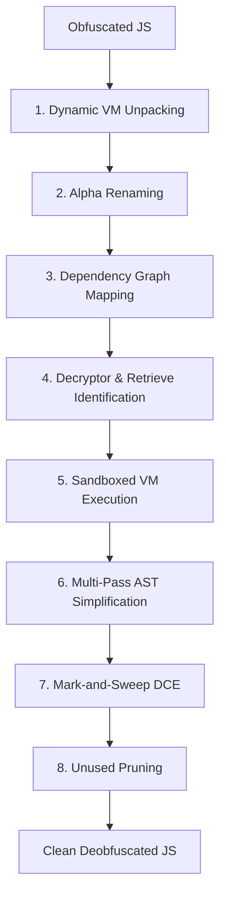

# JS-Confuser Deobfuscator

A powerful, high-performance AST-based deobfuscator specifically designed to reverse complex obfuscation patterns generated by **JS-Confuser**. By leveraging Babel for AST manipulation and Node.js VM for safe sandboxed execution, this tool can completely unpack, decrypt, propagate, and prune obfuscated structures to recover readable source code.

## Key Obfuscation Techniques Reversed

**JS-Confuser** is known for severe transformations that make static analysis incredibly difficult. This tool addresses and reverses them:
*   **Global Injectors & Function Wrappers (RGF)**: Unpacks code wrapped inside nested IIFE closures or dynamically compiled via `new Function(...)` (Random Generator Functions).
*   **String & Object Concealing**: Resolves lookups through single/multi-argument decryptor dispatchers and decodes strings encrypted with XOR, Base64, or custom algorithms.
*   **Variable Masking & Shadowing**: Eliminates variable scope shadowing through full Alpha Renaming.
*   **Control Flow Flattening**: Evaluates conditional expressions and loops statically to eliminate switch-based flat control flow.
*   **Dead Code Injection**: Eradicates large blocks of junk code, unused helper arrays, and dead branches.

---

## Deobfuscation Architecture & Pipeline

The deobfuscator pipeline consists of **8 distinct phases** designed to systematically strip away obfuscation layers:



### 1. Dynamic VM-Based Unpacking
JS-Confuser often wraps the entire script in an IIFE or compiles it via `new Function()`.
*   We run the obfuscated code in a sandboxed `vm` context with the global `Function` constructor overridden.
*   We intercept and capturecompiled scripts. If a compiled script is a valid JS block and is reasonably large, we extract it as the next layer.
*   This loops recursively to peel back nested `pack: true` layers.

### 2. Alpha Renaming
To prevent variable shadowing from breaking static analysis and replacement, we traverse the AST and rename all identifiers in sub-scopes to globally unique UIDs (e.g. `_name` -> `_name_uid`).

### 3. Dependency Mapping
We parse declarations (`VariableDeclarator`, `FunctionDeclaration`) and assignments (`AssignmentExpression`) to build a complete dependency graph:
*   **Forward Graph**: Tracks which top-level names depend on other names.
*   **Reverse Graph**: Tracks which names are depended upon by other names.

### 4. Retrieve Function Identification
We identify candidate retrieve functions (decryptors) using two passes:
1.  **Static Pattern Matching**: Scans for standard retrieve patterns (e.g. functions receiving indices/keys and doing array offsets).
2.  **Boilerplate Heuristics**: Recursively adds functions that references boilerplate data variables (very large arrays/strings) or calls already identified decryptors.

### 5. Sandboxed VM Execution & Dynamic Filtering
We isolate all boilerplate dependencies and decryptors, generating a clean `sandbox_debug.js` file.
*   We run this code in a secure Node.js `vm` context.
*   **Dynamic Filtering**: To avoid false positives, we call every candidate function inside the sandbox. If it runs successfully and returns valid strings/numbers/objects, we confirm it is a decryptor. This prevents running unsafe user functions.

### 6. Multi-Pass AST Simplification
We run a loop of AST simplifications until no more changes occur (up to 10 passes):
*   **VM Evaluation**: Replace decryptor calls (e.g. `_0x12ab("0x5f")`) and property lookups with their actual evaluated outputs from the VM context.
*   **Constant Folding**: Statically resolve binary operators (e.g. `12 + 5` -> `17`, `"a" + "b"` -> `"ab"`).
*   **Branch & Control Flow Simplification**: Evaluate test expressions for `if`, `while`, `switch`, and conditional expressions. Dead branches are removed, and any `var` declarations in pruned branches are hoisted (`hoistVars`) to avoid breaking runtime references.
*   **State Array Propagation**: Inline values from immutable arrays passed as parameters into functions.
*   **Inline Constant Propagation**: Propagate constant local variables to resolve intermediate variables.

### 7. Mark-and-Sweep Dead Code Elimination (DCE)
Once decryptors are resolved, their massive helper arrays, index rotation functions, and decoding utilities are no longer called.
*   We mark all reachable symbols starting from the actual program code (reachable roots).
*   We sweep away any boilerplate declarations, variables, and assignments that are no longer reachable, shrinking file sizes (e.g. from 1.5MB to 2KB).

### 8. Unused Top-Level Pruning
Finally, we run a cleanup pass to remove any unused variables and function declarations to produce clean, readable, and ready-to-beautify source code.

---

## Directory Structure

```text
js-confuser-deobfuscator/
├── deobfuscator.js         # Driver script coordinating the 8 phases
├── package.json            # Node.js dependencies
└── src/
    ├── core/
    │   ├── dce.js          # Mark-and-Sweep DCE & unused identifier pruning
    │   ├── sandbox-vm.js   # Sandboxing setup and decryptor validation
    │   └── simplifier.js   # Multi-pass AST simplification loop
    └── utils/
        ├── ast-utils.js    # AST inspection, evaluation, and scope helpers
        └── unpack-utils.js # IIFE and Function constructor static unpackers
```

---

## Installation & Usage

### 1. Installation
Clone the repository and install the dependencies:
```bash
git clone https://github.com/onlytrisdev/js-confuser-deobfuscator.git
cd js-confuser-deobfuscator
npm install
```

### 2. Deobfuscating a File
Run the driver script passing the obfuscated file path and the target output path:
```bash
node deobfuscator.js <obfuscated_file.js> <clean_output.js>
```
Example:
```bash
node deobfuscator.js input.js output.js
```
